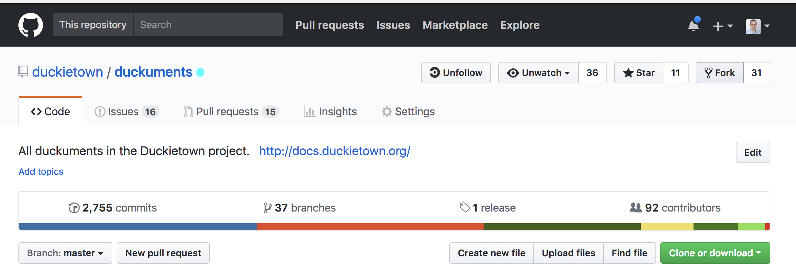

# Second method: local editing+docker {#duckumentation-workflow status=ready}

This section describes the workflow to edit the documentation for one single obok.

In a nutshell:

* You *fork* the repos to your Github account.
* You compile locally using a Docker container (no installation necessary).
* You contribute by opening a pull request.

## Workflow

### Github setup

We assume that you have setup a Github account with working public keys.

See: [Basic SSH config](+software_reference#ssh-local-configuration).

See: [Key pair creation](#howto-create-key-pair).

See: [Adding public key on Github](#howto-add-pubkey-to-github).

### Install Docker

Before you start, make sure that you have [installed Docker](+software_reference#docker).

 
### Fork the `docs-![book]` repo on the Github site

Fork one of the `docs-![book]` repos on the Github site ([](#fork-duckuments)).

This will create a new repo on your account that is linked to the original one.

<figure id="fork-duckuments">
 
</figure>

TODO: re-make image

### Checkout your fork locally

Check out the forked repository as you would do normally.

### Do your edits

Do your edits on your local copy.

### Compile

Compile using:

```
$ make compile-docker
```

### Commit and push

Commit and push as you would do normally.

### Make a pull request

Create a pull request to the original repository.

#### Option 1: Use the Github website

Github offers a nice interface to create a pull request.

TODO for volunteer: add image of pull request 

#### Option 2: Use the command-line program `hub`

You can create a pull request from the command-line using [`hub`](+software_reference#hub):

```
$ hub pull-request
```

See: [](#hub)


## Using CircleCI

Circle CI makes it easier to check whether there are problems to be fixed.

### Sign up on Circle

Sign up on the Circle CI service, at the link [circleci.com](http://circleci.com).

### Activate your build on Circle

Activate the building at the link:

```
https://circleci.com/setup-project/gh/![username]/duckuments
```

where `![username]` is your Github username.

Click "start building".

####  Make sure everything compiles on Circle

Go to the URL:

```
https://circleci.com/gh/![username]/duckuments
```

to see the status of your build.

You can also preview the results by clicking the "artifacts" tab and selecting `index.html` from the list.

<figure id="ci-artifacts">
 
</figure>


## Reporting problems

First, see the section [](#markduck-troubleshooting) for common problems and their resolution.

Please report problems with the duckuments using [the `duckuments` issue tracker][tracker].

[tracker]: https://github.com/duckietown/duckuments/issues

Special notes:

* If you have a problem with a generated PDF, please attach the offending PDF.
* If you say something like "This happens for Figure 3", then it is hard to know which figure you are referencing exactly, because numbering changes from commit to commit.


If you want to refer to specific parts of the text, please commit all your work on your branch, and obtain the name of the commit using the following commands:

```
$ git -C ~/duckuments rev-parse HEAD      # commit for duckuments
$ git -C ~/duckuments/mcdp rev-parse HEAD # commit for mcdp
```
