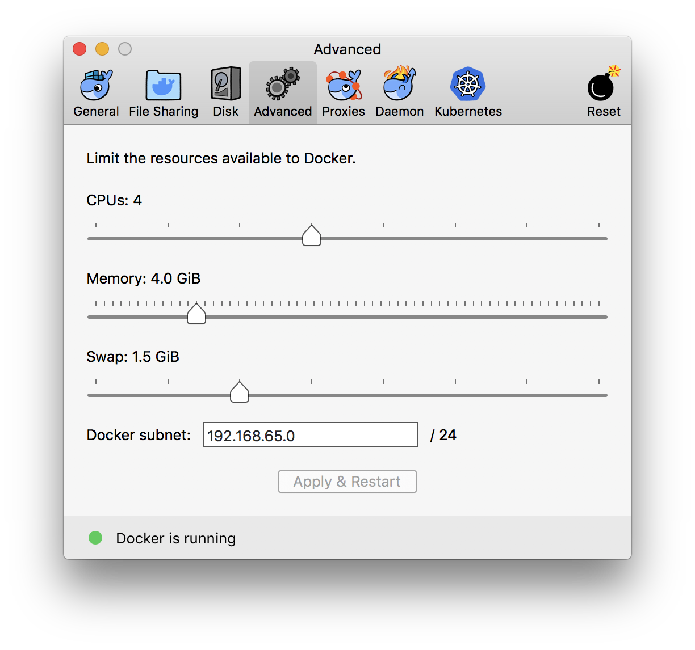

# Troubleshooting for Duckumentation {#troubleshooting-docker status=ready}


## Markduck problems

First, see the section [](#markduck-troubleshooting) for common problems and their resolution.

Please report problems with the duckuments using [the `duckuments` issue tracker][tracker].

[tracker]: https://github.com/duckietown/docs-duckumentation/issues

Special notes:

* If you have a problem with a generated PDF, please attach the offending PDF.
* If you say something like "This happens for Figure 3", then it is hard to know which figure you are referencing exactly, because numbering changes from commit to commit.

If you want to refer to specific parts of the text, please commit all your work on your branch, and obtain the name of the commit using the following commands:

```
$ git rev-parse HEAD 
```


## Problem: The building hangs {#troubleshooting-build-hangs}

### Cause: insufficient memory

This might be due to insufficient memory. 

For example, on Mac, the default setting is 2GB of RAM.
Try increasing it ([](#docker-memory)).

<figure id="docker-memory">
    
</figure>

A workaround is to stop and restart the process (but without doing `dts docs clean`).


### Cause: downloading in the background

Sometimes the problem is that the code is downloading something in the background, for example a Git repository.

Currently this is hard to debug. 


